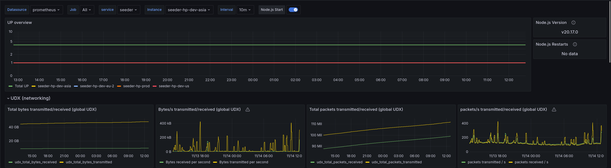
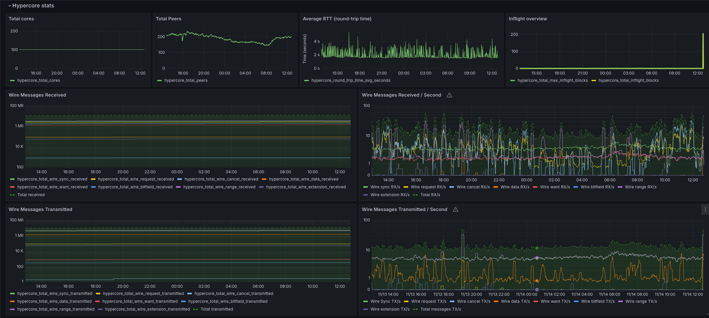
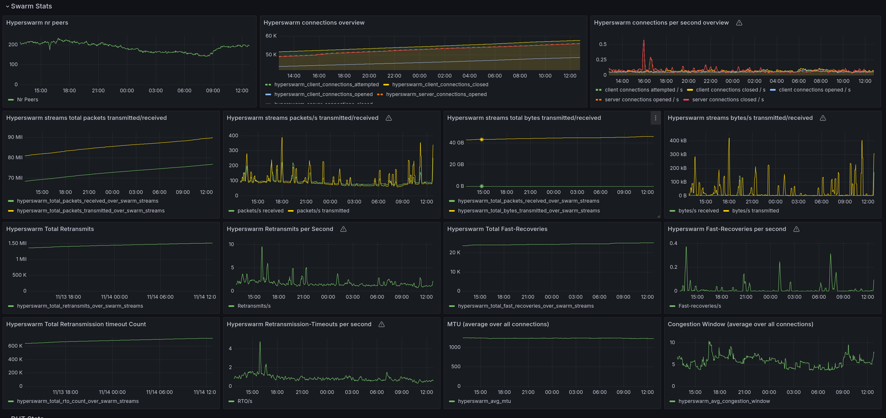
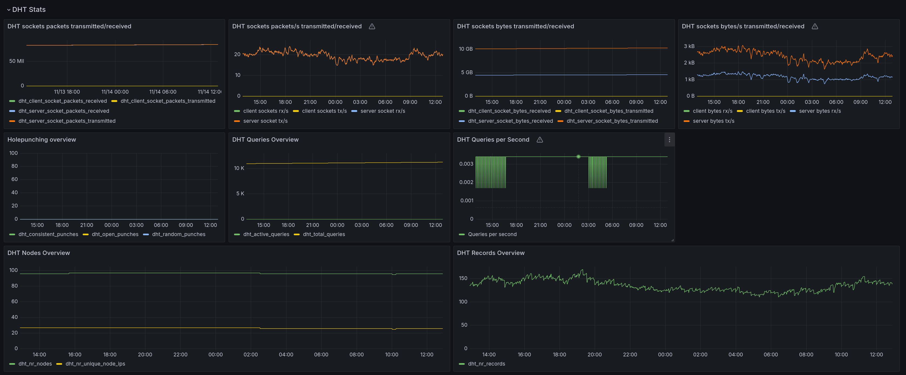
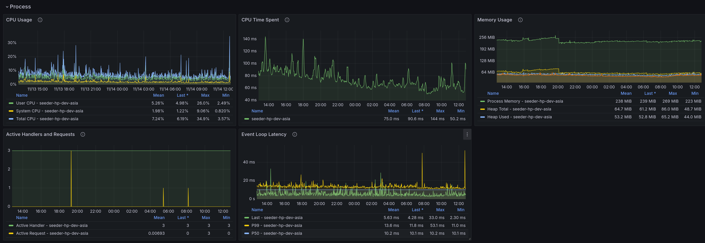
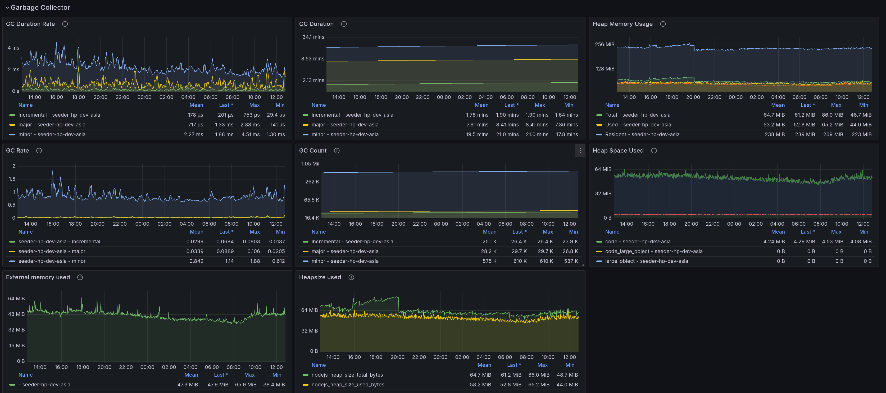

# Grafana Hypercore Stats

Grafana dashboard for the Prometheus metrics exposed by [hypercore-stats](https://github.com/holepunchto/hypercore-stats), [hyperswarm-stats](https://github.com/holepunchto/hyperswarm-stats) and [hyperdht-stats](https://github.com/holepunchto/hyperswarm-stats).

Built on top of [Node.js Exporter Quickstart and Dashboard](https://grafana.com/grafana/dashboards/14058-node-js/) (for the Node.js metrics).

## Screenshots

